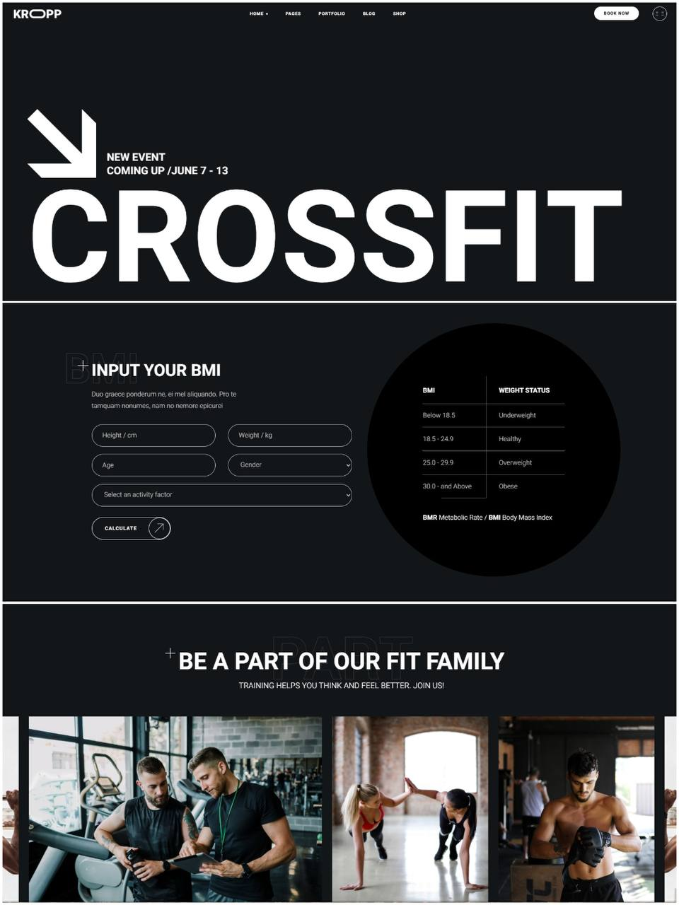

# Kropp Fitness — Fitness Club Website

[](https://yakubova6.github.io/kropp-fitness/)

A responsive landing page for a fitness club, built with **pure HTML and CSS**.  
The project focuses on clean layout, modern styling, and adaptive design across all devices.


<p align="center">
  
</p>

---

## Live Demo

**[View Live Site](https://yakubova6.github.io/kropp-fitness/)**

---

## Features

- **Pure HTML & CSS** — no frameworks or libraries
- **Fully Responsive Design** — mobile, tablet, and desktop
- **Modern CSS Techniques** — Flexbox, Grid, animations
- **Semantic Markup** — accessible and well-structured HTML
- **Optimized Performance** — fast loading times
- **Cross-Browser Compatibility** — consistent behavior across browsers

---

## Technologies Used

- **HTML5** — semantic and accessible markup
- **CSS3** — Flexbox, Grid, Media Queries
- **Git & GitHub Pages** — version control and deployment

---

## Getting Started

To run the project locally:

1. Clone the repository:
```bash
git clone https://github.com/yakubova6/kropp-fitness.git
```

2. Open `index.html` in your browser.
